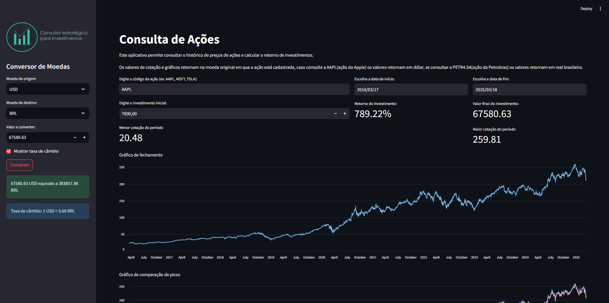

<p align="center">
  
</p>

<p align="center">
    
       
    
    <br>
    <a href="https://share.streamlit.io/user/pedroryandatadev"></a>
    <a href="https://www.figma.com/@pedroryandata"></a>
</p>

O objetivo deste projeto é consultar dados de empresas do mercado de ações, visualizar seu desempenho e calcular valores de investimento de acordo com as especificações definidas.

Esse projeto realiza a visualização de valores e do desempenho de ações de acordo com o período de tempo especificado.

Nesse projeto existem blocos de comparação de valores e gráficos de progresso e comparação, além de um calculador de investimento.

> [!IMPORTANT]
> As informações exibidas neste projeto são provenientes das APIs utilizadas e podem não refletir com exatidão os valores reais do mercado financeiro.

<p align="center">
  
</p>

# APi & Dados

Foram utilizados duas fontes de dados sendo elas a api `alphavantage` para obter dados de ações, para as moedas a api do `Exchangerate-API`.

- Documentação da Api [AlphaVantage](https://www.alphavantage.co/documentation/)

- Documentação da Api [Exchangerate-API](https://www.exchangerate-api.com/docs/overview)


## Funções utilizadas 

- Seletor e conversor de moedas
- Visualizador de taxa de câmbio (moeda)
- Input de ações
- Seleção de datas inicio e fim
- Projetor de investimento com retorno do percentual mais valor final
- Indicadores de menor e maior cotação 
- Gráfico de desempenho ao longo do tempo
- Gráfico de comparação alta e baixa ao longo do tempo
<p align="center">
  
</p>

> [!NOTE]
> Os dados exibidos na imagem da interface podem diferir dos valores atuais, pois a fonte de dados das ações foi alterada após a captura da imagem.

# Requerimentos

Uso das bibliotecas `requests`, `pandas` e `streamlit`.

Instalação pode ser feita pelo requirements.txt para evitar conflitos de versões:

``` 

    pip install -r requirements.txt

```

## Licença

```
Desenvolvimento e design em 2025 por pedroryandatadev (Pedro Ryan)

Este projeto está licenciado sob a licença MIT. Consulte o arquivo LICENSE para obter mais informações.
```